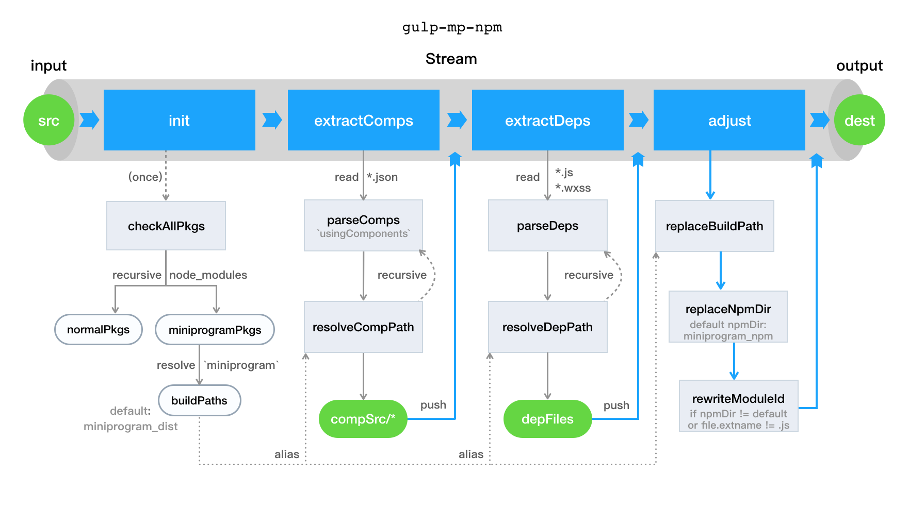

# gulp-mp-npm

[](https://www.npmjs.com/package/gulp-mp-npm)
[](https://www.npmjs.com/package/gulp-mp-npm)

> 用以微信小程序提取 npm 依赖包的 gulp 插件

## 安装

```
$ npm i -D gulp-mp-npm
```

## 使用

```js
const gulp = require('gulp');
const mpNpm = require('gulp-mp-npm')

gulp.src('src/**')
    .pipe(mpNpm())
    .pipe(gulp.dest('dist'));
```

## API

### mpNpm(options)

`Stream` 输入原文件，输出依赖文件与修改后的原文件

#### options.npmDirname

类型: `String`\
默认值: `'miniprogram_npm'`

指定 `npm` 输出文件夹，默认为官方方案。\
小程序基础库版本 `2.2.1` 及以上**推荐使用官方方案**，即不设置该值。如果自定义输出，将会修改所有原文件中引入依赖路径的代码


## 特点

- 依赖分析，仅会提取使用到的依赖与组件
- 支持提取普通 `npm` 包与小程序专用 `npm` 包
- 不会对依赖进行编译与打包（交给微信开发者工具或者其他 `gulp` 插件完成）
- 兼容[官方方案](https://developers.weixin.qq.com/miniprogram/dev/devtools/npm.html)及原理，同时支持自定义 npm 输出文件夹

## 方案

### 官方原理

在小程序[官方方案](https://developers.weixin.qq.com/miniprogram/dev/devtools/npm.html)文档中可以找到了对原理的介绍：

> 1、首先 node_modules 目录不会参与编译、上传和打包中，所以小程序想要使用 npm 包必须走一遍“构建 npm”的过程，在最外层的 node_modules 的同级目录下会生成一个 miniprogram_npm 目录，里面会存放构建打包后的 npm 包，也就是小程序真正使用的 npm 包。
>
> 2、构建打包分为两种：小程序 npm 包会直接拷贝构建文件生成目录下的所有文件到 miniprogram_npm 中；其他 npm 包则会从入口 js 文件开始走一遍依赖分析和打包过程（类似 webpack）。
>
> 3、寻找 npm 包的过程和 npm 的实现类似，从依赖 npm 包的文件所在目录开始逐层往外找，直到找到可用的 npm 包或是小程序根目录为止。

> 使用 npm 包时如果只引入包名，则默认寻找包名下的 index.js 文件或者 index 组件

### 插件方案



整个插件是一个 `Stream` 流管道，其中包含了 `4` 个子流：

- `init` 初始化
- `extractComps` 提取小程序组件依赖
- `extractDeps` 提取普通依赖
- `adjust` 调整输出


### License

MIT
